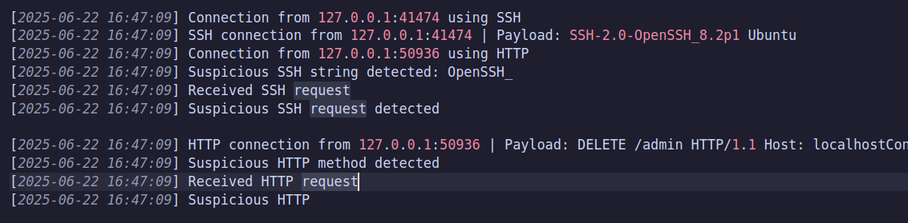

# AGH Programowanie Sieciowe - Projekt
Aleksander Brzykcy: abrzykcy@student.agh.edu.pl
# 🛡️ Honeypot TCP (Legacy + Multithreaded)

Projekt to prosty **TCP honeypot**, który nasłuchuje na trzech typowych portach usług sieciowych:

- **HTTP** na porcie 8080  
- **SSH** na porcie 2222  
- **Telnet** na porcie 2323  

Celem jest wykrywanie i rejestrowanie podejrzanych połączeń oraz zachowań na tych portach. Projekt implementuje dwie wersje honeypota, które umożliwiają porównanie tradycyjnego podejścia z implementacją wielowątkową.

---

## 📖 Opis działania

### 1. Legacy (jednowątkowy)

- Wykorzystuje `select()` do obsługi wielu portów w jednym wątku.  
- Połączenia są obsługiwane sekwencyjnie – jedno po drugim.  
- Prosty, ale może powodować blokowanie i opóźnienia przy większej liczbie połączeń.

### 2. Multithreaded

- Dla każdego protokołu (HTTP, SSH, Telnet) uruchamiany jest osobny wątek.  
- Połączenia przychodzące na każdy port obsługiwane są niezależnie i równolegle.  
- Zwiększa wydajność i responsywność honeypota, zwłaszcza przy wielu jednoczesnych atakach.

---

## 🔥 Funkcjonalności

- Obsługa czarnej i białej listy IP (blacklist/whitelist).  
- Proste heurystyki wykrywające podejrzane treści w zapytaniach (np. próby logowania root, podejrzane ciągi znaków).  
- Logowanie połączeń i zdarzeń wraz z IP, portem, protokołem i timestampem.  
- Możliwość łatwego przełączania między trybami legacy i multithreaded.

---

## 💻 Kompilacja i uruchamianie

Projekt korzysta z prostego `Makefile`.

```bash
make
```

## 📸 Screenshots

Poniżej znajdują się zrzuty ekranu pokazujące działanie wersji wielowątkowej honeypota:



*Rys. 1 – Widoczna jest równoczesna obsługa połączeń na portach HTTP i SSH.*

## 🧪 Testowanie honeypota

### Testy automatyczne za pomocą Pythona

W projekcie znajduje się skrypt `honeypot_tests.py`, który wykonuje zestaw testów symulujących ataki na wszystkie trzy porty honeypota:

- **Telnet (2323)**  
- **SSH (2222)**  
- **HTTP (8080)**

Skrypt wysyła zarówno "podejrzane", jak i "normalne" payloady i wyświetla odpowiedzi serwera.

---

### 🔄 Przełączanie między testami Legacy i Multithread

W pliku `honeypot_tests.py` zaimplementowane są dwie oddzielne funkcje testowe:

- `legacy_test()` — do testowania starej, jednowątkowej wersji honeypota  
- `multithread_test()` — do testowania nowej, wielowątkowej wersji honeypota  

Aby wybrać, którą wersję testujesz, wystarczy zmienić wywołanie w funkcji `main()`:

```python
def main():
    # Aby testować wersję Legacy (jednowątkową), odkomentuj poniższą linię:
    #legacy_test()

    # Aby testować wersję Multithread (wielowątkową), odkomentuj poniższą linię:
    multithread_test()
```

### 🔧 Przykładowe testowanie manualne

Możesz sprawdzić działanie honeypota ręcznie, wysyłając różne zapytania na odpowiednie porty za pomocą narzędzi takich jak `curl`, `nc` (netcat) czy `telnet`.

#### HTTP (port 8080)

- Sprawdzenie podstawowego żądania GET:

    ```bash
    curl -v http://127.0.0.1:8080/

- Symulacja podejrzanego żądania DELETE:
    ```bash
    curl -X DELETE http://127.0.0.1:8080/admin

- Wysłanie zapytania z podejrzanym nagłówkiem User-Agent:
    ```bash
    curl -H "User-Agent: sqlmap" http://127.0.0.1:8080/

- Połączenie przez telnet i wysłanie przykładowaych danych:
    ```bash
    telnet 127.0.0.1 2323 # Połącz się i wpisz np.: root

- Połączenie przez SSH i wysłanie ciagu znaków:
    ```bash
    nc 127.0.0.1 2222 # Po połączeniu wpisz np.: Trying root login
